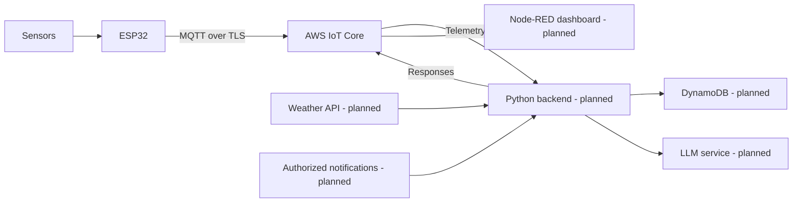

# GreenPulse

### A healthier home, a happier plant

GreenPulse is an IoT plant-care project developed for **IT4030: Internet of Things**, SLIIT Faculty of Computing (2026). The proposal describes an end-to-end system that turns environmental readings into contextual plant-care information using an ESP32, secure MQTT, cloud services, an LLM backend, and a Node-RED dashboard.

> **Project status:** This repository currently contains the ESP32 firmware, wiring guide, proposal, and presentation. The Python cloud backend, database integration, external-service integrations, and Node-RED dashboard are part of the proposed system and are not included here yet.

## How It Works

The proposed system has four parts:

1. **Device:** An ESP32 reads soil moisture, soil and air temperature, humidity, and light. An OLED shows local readings and connection state; RGB indicators show plant and network status.
2. **Secure communication:** The device exchanges JSON messages with AWS IoT Core using MQTT over TLS.
3. **Cloud intelligence:** A planned Python backend validates and stores sensor readings, gathers weather and relevant notification context, and uses an LLM to prepare care tips, a literary quote, and summaries.
4. **Dashboard:** A planned Node-RED dashboard brings sensor readings, device and MQTT status, and generated information together.

## What Is Implemented

The current sketch, [`IOT_GreenPulse.ino`](IOT_GreenPulse.ino), implements the ESP32 monitoring device:

- Reads an analog soil-moisture sensor, DHT22, BH1750, and DS18B20.
- Displays measurements and status on a 128 x 64 SSD1306 OLED.
- Uses one RGB LED for plant priority and a second for Wi-Fi/MQTT connectivity.
- Evaluates sensor readings as normal, warning, or critical and reports sensor errors.
- Connects to Wi-Fi and can connect to AWS IoT Core using MQTT over TLS.
- Publishes sensor telemetry and an online status message; reconnects after network interruptions.
- Subscribes to the care and weather response topics. Incoming messages are printed to Serial; the sketch does not generate LLM responses.

The proposal's backend, DynamoDB storage, weather and email retrieval, LLM processing, and Node-RED dashboard should be treated as **planned features**, not capabilities delivered by this firmware repository. The proposal also does not make automatic watering part of the core system.

## Hardware and Pin Connections

| Component | ESP32 connection |
| --- | --- |
| DHT22 data | GPIO 4 |
| Soil-moisture analog output | GPIO 34 |
| DS18B20 data | GPIO 32 (4.7 kOhm pull-up to 3.3 V) |
| I2C SDA | GPIO 21 |
| I2C SCL | GPIO 22 |
| Plant-status RGB LED, R/G/B | GPIO 25 / 26 / 27 |
| Network-status RGB LED, R/G/B | GPIO 18 / 19 / 23 |

The BH1750 uses I2C address `0x23`. The OLED is detected at `0x3C` or `0x3D`. Both I2C devices share GPIO 21/22. Use common-cathode RGB LEDs with current-limiting resistors. See [`GreenPulse_Wiring_and_RGB_Indicator_Guide.docx`](GreenPulse_Wiring_and_RGB_Indicator_Guide.docx) for the wiring guide.

## Build and Run the Firmware

1. Open `IOT_GreenPulse.ino` in the Arduino IDE and select the appropriate ESP32 board and serial port.
2. Install the ESP32 board support package and these libraries through Library Manager:
   - PubSubClient
   - Adafruit GFX Library
   - Adafruit SSD1306
   - DHT sensor library
   - BH1750
   - ArduinoJson
   - OneWire
   - DallasTemperature
3. Configure Wi-Fi and AWS IoT Core settings locally, following the security guidance below.
4. Upload the sketch and open Serial Monitor at `115200` baud.

MQTT over TLS uses port `8883`. The current firmware topics are:

| Topic | Firmware behavior |
| --- | --- |
| `greenpulse/sensors` | Publishes sensor JSON, including a device ID and sequence number. |
| `greenpulse/status` | Publishes the online status message after connecting. |
| `greenpulse/ai/care` | Subscribes to cloud responses; no LLM generation is implemented in this repository. |
| `greenpulse/ai/weather` | Subscribes to cloud responses; no weather service is implemented in this repository. |

The proposal additionally describes `greenpulse/ai/notifications` and `greenpulse/command`; they are not currently used by the firmware.

## Soil-Moisture Calibration

The sketch currently uses demonstration values (`SOIL_DRY_RAW = 4095`, `SOIL_WET_RAW = 1500`) and marks the resulting percentage as a demo. For useful readings, measure the sensor's raw ADC value in dry soil and in watered, drained soil, update those constants, and set `SOIL_DEMO_CALIBRATION` to `false`.

## Proposal and Presentation

- [`GreenPulse_Project_Proposal-IT23257054-IT23182882-IT23284470-IT23160484.pdf`](GreenPulse_Project_Proposal-IT23257054-IT23182882-IT23284470-IT23160484.pdf) describes the motivation, design, planned implementation, and evaluation.
- [`GreenPulse_Proposal_Presentation.pptx`](GreenPulse_Proposal_Presentation.pptx) summarizes the architecture, hardware, MQTT topics, planned dashboard, testing, and team responsibilities.

## Security

The current firmware file contains hardcoded Wi-Fi credentials and AWS IoT device credentials, including a private key. **Do not push the current sketch to a public GitHub repository.** Revoke or rotate exposed credentials, remove them from the source, and load replacements from a private, untracked configuration before publishing. Because the sketch is already in Git history, removing credentials only in a later commit will not erase the earlier copies; if this history has been shared, clean the repository history as well.

## Project Team

- Kumarathunga R C S
- Wathsala K L K
- Senanayake Y M
- Methsuka S A I